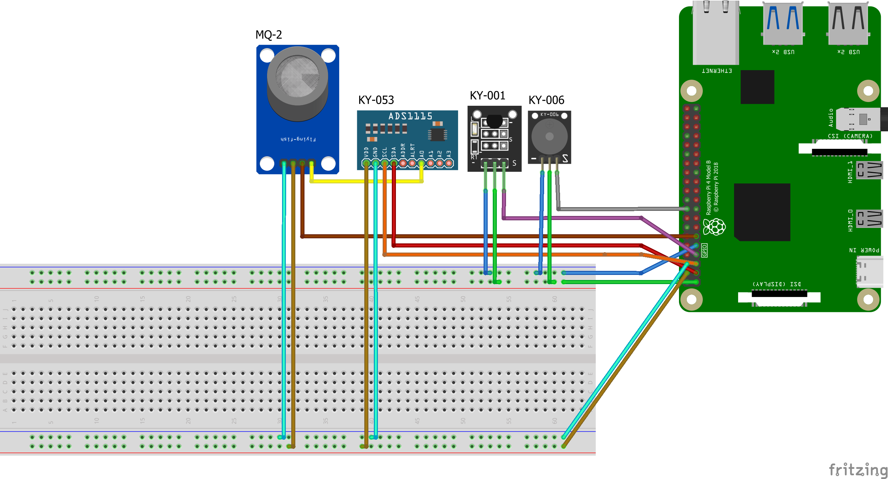

# Phoenix Fire Alarm Project - Sensor Module
This is the repository for the sensor module required for the Main module to receive data.

## Installing the Sensor Module
- Download the files from the git repository: `git clone --branch SensorNode https://gitlab.utwente.nl/computer-systems-project/2023-2024/student-projects/cs23-35/cs23-35-main.git`
- Install the libraries: `pip install -r requirements.txt`

## Configure the Sensor Module
Before running the sensor module, some configurtions have to be made.

### Configure the server
For the node to work properly, it has to transmit its data to the server. To do this, the node sends HTTP requests to the servers web server.
### Set the address of the server:
- Go to the file: `src/web.py`
- Change the value of the `HTTP_SERVER` constant to match the address of the http address of the server (e.g. `"http://127.0.0.1:8000"`)
**Make sure you DO NOT add a `/` at the end of the server address!**

### Configure the sensitifity of the sensors
To make the sensors more or less sensitive, you can change their critical values.
- Got to the file: `src/node.py`
- Update any of the `CRITICAL_` or `PRIORITY_` values

## Configure the sensors
### Required sensors
- KY-006 Passive Buzzer Module
- KY-001 Temperature sensor
- KY-053 Analog digital converter
- MQ-2   Gas sensor
- Raspberry PI Camera V2

### Configure the camera
Plug-in the ribbon cable of the PI camera in the designated slot of the raspberry PI

### Connecting the sensor to the PI
Connect the sensors to the GPIO pins like displayed in the image.
To have a clearer view, open the `Sensor_module.fzz` file in [Fritzing](https://fritzing.org/), the open source software we used to create the schematic.


### Prepare the sensors
Some of the sensor modules need some preperation before they will work properly.

#### Temperature sensor
To let the temperature sensor work, communication over One-Wire bus has to be activated on your PI.
- Edit `/boot/config.txt`: `sudo nano /boot/config.txt`
- Add the following line to the end of the file:
```
dtoverlay=w1-gpio,gpiopin=4
```

#### Gas Sensor
The gas sensor makes use of the analog digital converter. For this to work, I2C has to be enabled on your PI.
- Open the raspberry pi config: `sudo raspi-config`
- Navigate to: `Interfacing Options`->`I2C`, and enable I2C.

#### Finally
When all sensors are configured, reboot the PI to apply all the changes: `sudo reboot`.

## Starting the Node module
After you have finished the setup, you can run the sensor node by running `python main.py`.

## Stop the Node module
Press `ctrl+c` in the terminal the node is running on. It will now shutdown the node.